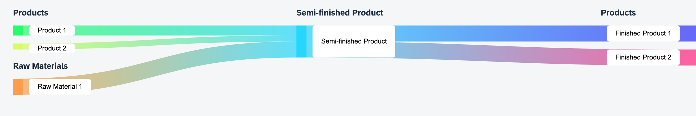

# UI5 Web Component Library for svelte-sankey

This is a UI5 typescript library that wraps the npm package [svelte-sankey](https://www.npmjs.com/package/svelte-sankey) into reusable UI5 controls.
Svelte-sankey is a library built with Svelte to create customizable sankey diagrams like:




## Preparation

Use `npm` (or `yarn`) to install the dependencies:

```sh
npm install
```

(To use yarn, just do `yarn` instead.)

## Run the Library

Execute the following command to run the library locally for development in watch mode (the browser reloads the app automatically when there are changes in the source code):

```sh
npm start
```

As shown in the terminal after executing this command, the app is then running on http://localhost:8080/. A browser window with the URL pointing to your controls' test page should automatically open.
